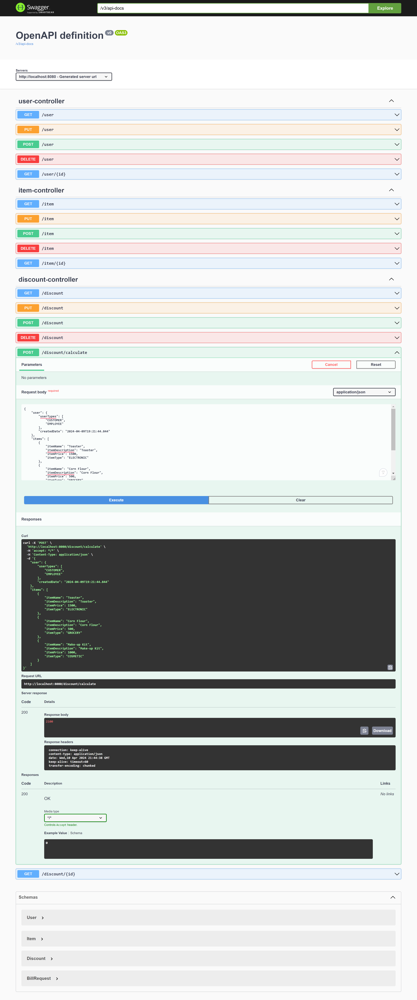
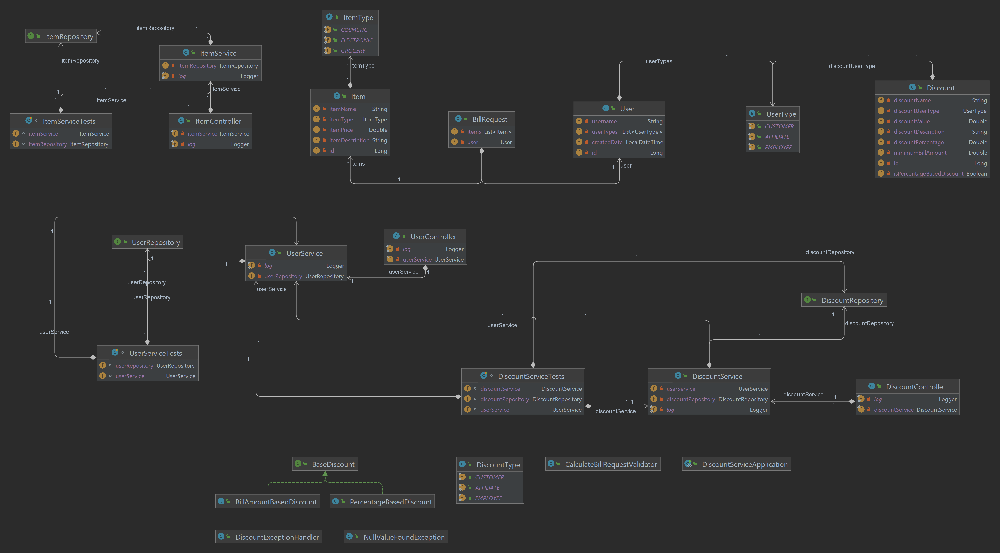
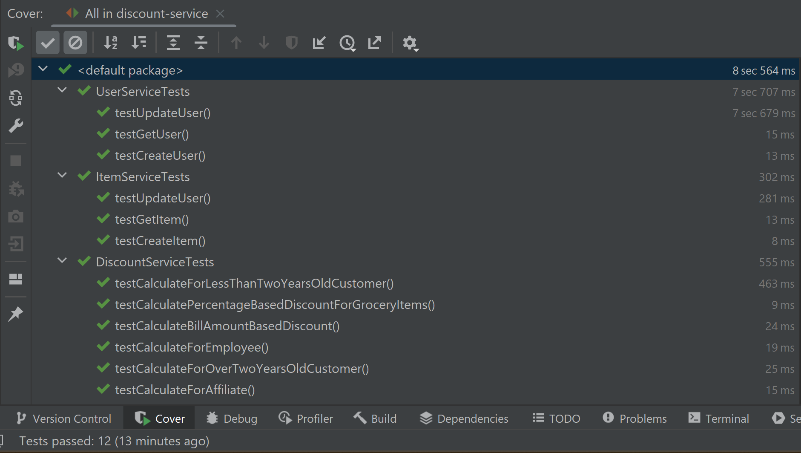
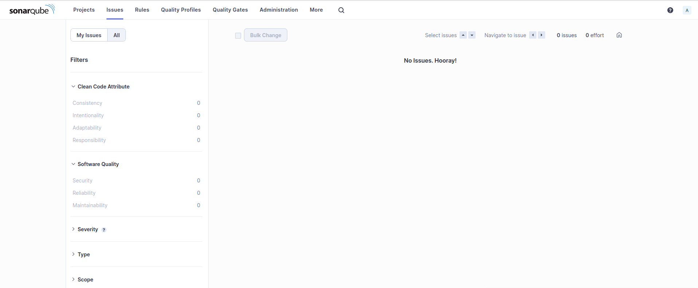

# **Project Information**

- GroupId: com.retailstore
- ArtifactId: discount-service
- Name: discount-service
- Spring Boot Version: 3.2.4
- Java Version: 17

# **Project Setup**

**1. Clone Repository**

Use the following command to clone this repository to your local machine

```bash
git clone https://github.com/aamiralihere/discount-service-adv.git
```

**2. Build the Project**
- Go to the cloned project directory and build the project using following command
- It will also run all the Tests along with creating a JAR file of the project in **\target** directory

```bash
mvn clean package
```

**3. Run**
-  Run the JAR File directly OR Build the Docker Image, choose one from option a OR b

**a. Run the JAR File**
- The JAR file named **discount-service-0.0.1.jar** will be present in \target directory of the project.
- Run the JAR file using the following command

```bash
java -jar discount-service-0.0.1.jar
```

**b.1 Build the Docker Image**
- Build the docker image using Dockerfile

```bash
docker build -t discount-service-0.0.1.jar
```

**b.2 Run Docker Container**
- Run the docker container using the following command

```bash
docker run -d -p 8080:8080 discount-service-0.0.1.jar
```

**c. Access the Application**
- The application is now accessible at **http://localhost:8080**

**4. Test with Swagger-UI**
- Go to this URL in the browser **http://localhost:8080/swagger-ui/index.html**
- Scroll down and click on POST request option of **/discount/calculate**
- Click **Try it out** button and run below request body by copying and pasting it on Swagger UI screen

**Request Body for Swagger UI**
```
{
    "user": {
        "userTypes": [
            "CUSTOMER",
            "EMPLOYEE"
        ],
        "createdDate": "2024-04-09T19:21:44.844"
    },
    "items": [
        {
            "itemName": "Toaster",
            "itemDescription": "Toaster",
            "itemPrice": 1500,
            "itemType": "ELECTRONIC"
        },
        {
            "itemName": "Corn Flour",
            "itemDescription": "Corn Flour",
            "itemPrice": 500,
            "itemType": "GROCERY"
        },
        {
            "itemName": "Make-up Kit",
            "itemDescription": "Make-up Kit",
            "itemPrice": 1000,
            "itemType": "COSMETIC"
        }
    ]
}
```
**Create dummy data with Swagger-UI**
- You can also create more dummy data for User, Item using the Swagger UI calls

**Screenshot for Swagger UI**



**5. Test with Postman**
- Send a POST request by adding the below given request body to this URL in the postman **http://localhost:8080/discount/calculate**

**Request Body for Postman**
```
{
    "user": {
        "userTypes": [
            "CUSTOMER",
            "EMPLOYEE"
        ],
        "createdDate": "2024-04-09T19:21:44.844"
    },
    "items": [
        {
            "itemName": "Toaster",
            "itemDescription": "Toaster",
            "itemPrice": 1500,
            "itemType": "ELECTRONIC"
        },
        {
            "itemName": "Corn Flour",
            "itemDescription": "Corn Flour",
            "itemPrice": 500,
            "itemType": "GROCERY"
        },
        {
            "itemName": "Make-up Kit",
            "itemDescription": "Make-up Kit",
            "itemPrice": 1000,
            "itemType": "COSMETIC"
        }
    ]
}
```

# **UML Class Diagram**



# **Test Cases** 



# **Sonar Report**


